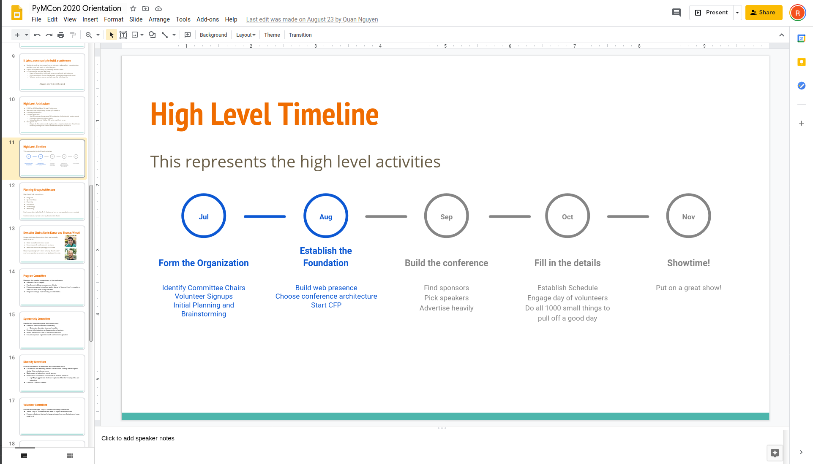

# Conference Overview 
A playbook does little good if we don't understand the high level principles of the game. Before
diving into the details lets talk about a conference at a high level.

As mentioned prior the conference is composed of multiple parts and no two conferences are
exactly the same, even the same conference year after year. However the major phases are generally
the same.

In rough order of start they are

1. Setting the vision/mission
2. Building the planning team
3. Solidifying conference architecture
4. Finding the contributors, such as speakers, vendors, sponsors
5. Engaging attendees
6. "Day of" execution

This can occur over the course of months, or for big conferences like DEFCON over the course of years.
For a  conference of our target size of 1 to 400 people a 6 to 9 month lead time is suggested
The biggest mistake I've made and I've seen others make is they focus too much on the day
of details way too early in the process. The trick to planning a conference 
is to identify these phases, execute on the current tasks at hand,
and smoothly transition from one to another. 

We'll break down each step in much more detail in the next sections. 

## Case Study: PyMCon 2020
For PyMCon this architecture conveyed early on in the planning process. We started planning
in late July, for an early November conference (The actual conference was October 31st). 

## Exercise
If you're planning a conference think about past just the conference itself. What will you need
to plan the conference? How much time? What people? What do you approximately think the timeline
will be? Do you feel like you have good answers for each of the steps above? 
Don't worry if you can't answer these questions immediately, but doing this exercise
now will help you understand where gaps are and prep you for the next sections.